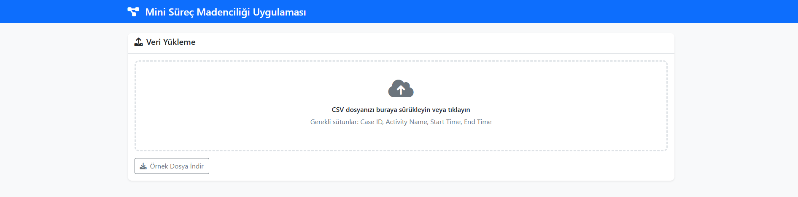
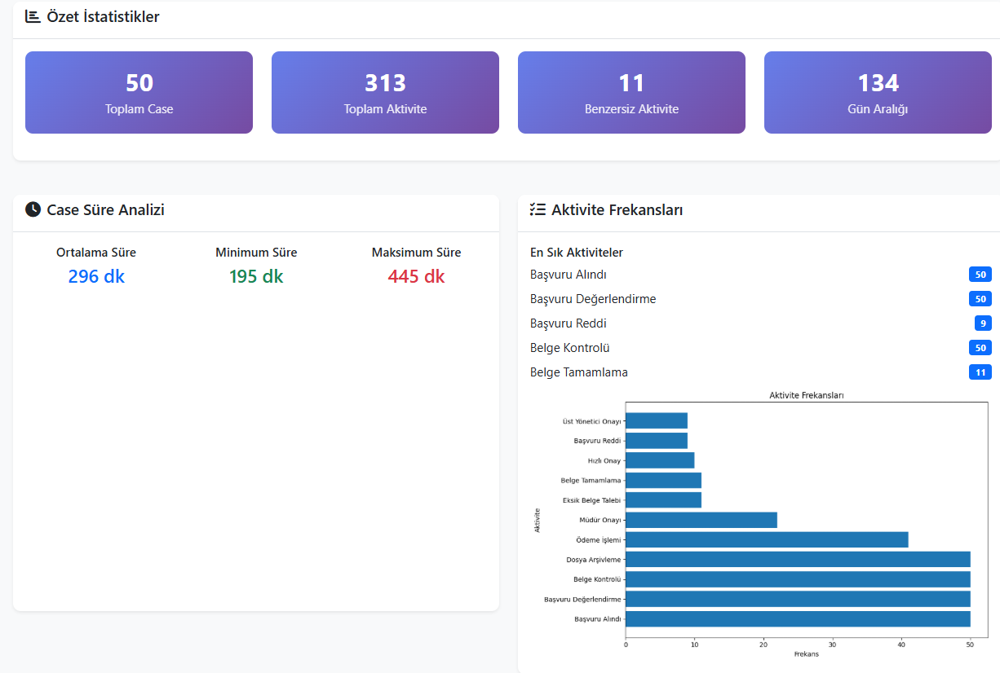
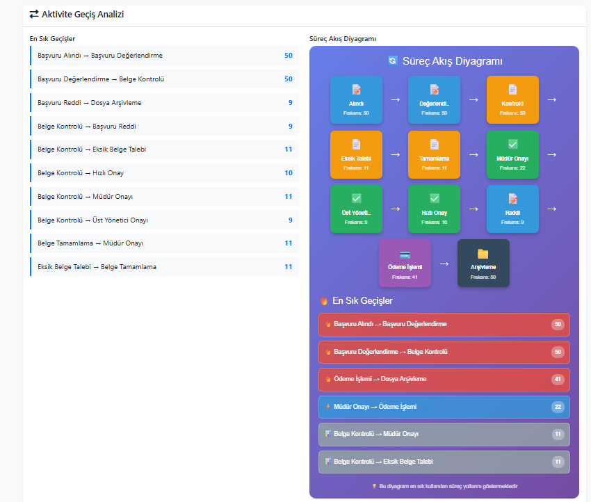
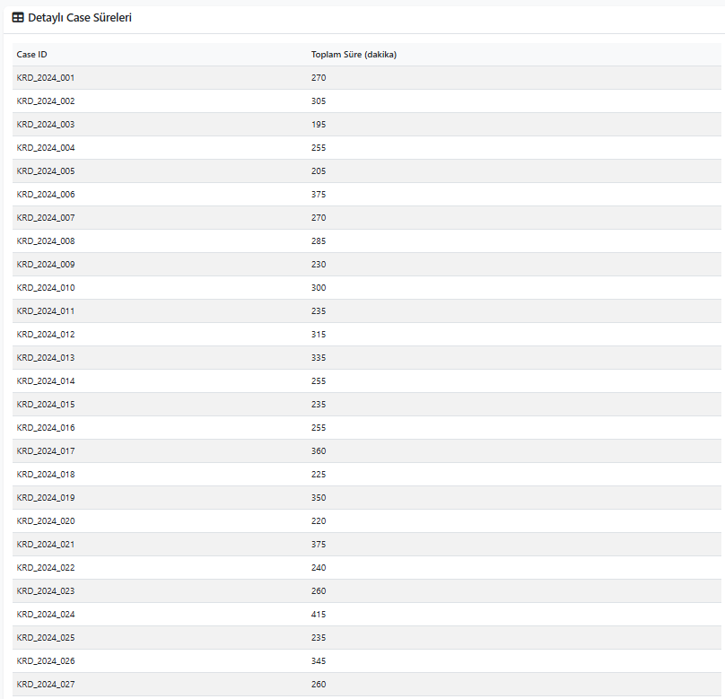

# 🔍 Mini Süreç Madenciliği Uygulaması

## Proje Github Linki https://github.com/UygarYildiz/SurecMadenciligi_Odevi

Bu proje, süreç madenciliği dersi için geliştirilmiş **kapsamlı ve profesyonel** bir web uygulamasıdır. CSV formatındaki süreç verilerini analiz ederek çeşitli görselleştirmeler, istatistikler ve BPMN tarzı süreç akış diyagramları sunar.

## 📸 Ekran Görüntüleri

### 🏠 Ana Sayfa ve Veri Yükleme

*Modern ve kullanıcı dostu arayüz ile drag & drop destekli dosya yükleme*

### 📊 Analiz Sonuçları Dashboard

*Kapsamlı özet istatistikler ve case süre analizleri*

### 🔄 Süreç Akış Diyagramı

*Modern HTML/CSS tabanlı BPMN tarzı süreç akış diyagramı*

### Case Süreleri

*Caselerin görüntülendiği tablo görünümü*

## 🚀 Özellikler

### ✅ Temel Süreç Madenciliği Gereksinimleri
- **📁 Veri Yükleme**: CSV dosyası yükleme (drag & drop destekli)
- **⏱️ Case Süre Analizi**: Her Case ID'nin toplam süresini hesaplama
- **📊 Aktivite Frekans Analizi**: En sık gerçekleşen adımları bulma
- **📈 Ortalama Süreç Süresi**: Tüm case'lerin ortalama tamamlanma süresi
- **🔄 Geçiş Analizi**: Aktiviteler arası en sık geçişleri analiz etme

### 🎨 Gelişmiş Görselleştirme Özellikleri
- **📊 İnteraktif Grafikler**: Plotly ile dinamik görselleştirmeler
- **🔄 Modern Süreç Akış Diyagramı**:
  - HTML/CSS tabanlı hafif tasarım (9.5MB → 73 byte optimizasyonu)
  - İkonlu aktivite kartları (📝📄✅💳📁❌)
  - Gradient arka plan ve hover efektleri
  - Responsive grid layout
  - Geçiş yoğunluğuna göre renk kodlaması
- **📱 Responsive Web Arayüzü**: Modern Bootstrap 5 tasarımı
- **📋 Özet İstatistikler**: Kapsamlı veri dashboard'u
- **📄 Detaylı Raporlama**: Tablo formatında sonuçlar

### ⚡ Performans ve UX İyileştirmeleri
- **🚀 Ultra Hızlı Yükleme**: Süreç diyagramı 99.9% boyut azaltması
- **💫 Smooth Animasyonlar**: CSS transition efektleri
- **🎯 Kullanıcı Dostu**: Sezgisel arayüz tasarımı
- **📊 Gerçek Zamanlı Analiz**: Anında sonuç gösterimi

## 📊 Kullanım Örnekleri ve Veri Seti

### 📁 Örnek Veri Seti: `sample_data_realistic.csv`
Uygulama ile birlikte gelen gerçekçi veri seti:
- **📈 50 Case**: Farklı başvuru süreçleri
- **🔢 314 Aktivite Kaydı**: Toplam işlem adımları
- **⏱️ Gerçekçi Zaman Damgaları**: 2024 yılı verileri
- **🔄 11 Farklı Aktivite Tipi**: Başvuru alımından arşivlemeye kadar

**Aktivite Türleri:**
- 📝 Başvuru Alındı / Değerlendirme
- 📄 Belge Kontrolü / Tamamlama / Eksik Belge Talebi
- ✅ Müdür Onayı / Üst Yönetici Onayı / Hızlı Onay
- ❌ Başvuru Reddi
- 💳 Ödeme İşlemi
- 📁 Dosya Arşivleme

### 📋 Gerekli CSV Sütunları

CSV dosyanızda şu sütunlar **mutlaka** bulunmalıdır:
- **`Case ID`**: Her süreç örneği için benzersiz kimlik (örn: "Case_001")
- **`Activity Name`**: Gerçekleştirilen aktivitenin adı (örn: "Başvuru Alındı")
- **`Start Timestamp`**: Aktivitenin başlangıç zamanı (`YYYY-MM-DD HH:MM:SS` formatında)
- **`Complete Timestamp`**: Aktivitenin bitiş zamanı (`YYYY-MM-DD HH:MM:SS` formatında)

## 🛠️ Kurulum ve Çalıştırma


### 🔧 Gerekli Python Paketleri
```txt
Flask==2.3.3
pandas==2.1.1
plotly==5.17.0
numpy==1.24.3
Werkzeug==2.3.7
```

### 📥 Kurulum Adımları

1. **📂 Projeyi İndirin:**
```bash
git clone [proje-url]
cd surec-madenciligi
```

2. **🐍 Virtual Environment Oluşturun (Önerilen):**
```bash
python -m venv venv
# Windows:
venv\Scripts\activate
# macOS/Linux:
source venv/bin/activate
```

3. **📦 Gerekli Paketleri Yükleyin:**
```bash
pip install -r requirements.txt
# veya manuel olarak:
pip install flask pandas plotly numpy
```

4. **🚀 Uygulamayı Çalıştırın:**
```bash
python app.py
```

5. **🌐 Tarayıcınızda Açın:**
```
http://localhost:5000
```


## 📊 Kullanım

### 1. Veri Yükleme
- Ana sayfada "CSV dosyanızı buraya sürükleyin" alanına dosyanızı sürükleyin
- Veya alana tıklayarak dosya seçici ile dosyanızı seçin
- Örnek veri için "Örnek Dosya İndir" butonunu kullanabilirsiniz

### 2. Analiz Sonuçları
Dosya yüklendikten sonra otomatik olarak şu analizler yapılır:
- **Özet İstatistikler**: Toplam case, aktivite sayıları
- **Case Süre Analizi**: Ortalama, minimum, maksimum süreler
- **Aktivite Frekansları**: En sık kullanılan aktiviteler
- **Geçiş Analizi**: Aktiviteler arası geçiş matrisi
- **Görselleştirmeler**: İnteraktif grafikler ve süreç akış diyagramı

## 📁 Proje Yapısı

```
Süreç_Ödev2/
├── 📄 app.py                      # Ana Flask uygulaması ve API endpoint'leri
├── 🧠 process_analyzer.py         # Süreç madenciliği analiz motoru
├── 📋 requirements.txt            # Python bağımlılıkları listesi
├── 📖 README.md                   # Proje dokümantasyonu
├── 📊 sample_data_realistic.csv   # Gerçekçi örnek veri seti (50 case, 314 kayıt)
├── 📁 templates/
│   └── 🌐 index.html             # Ana web arayüzü (Bootstrap 5)
├── 📁 static/
│   ├── 🎨 style.css              # Modern CSS stilleri ve animasyonlar
│   └── ⚡ script.js              # JavaScript etkileşim mantığı
└── 📁 uploads/                   # Kullanıcı dosyaları (otomatik oluşur)
```

### 📄 Dosya İşlevleri

- **`app.py`**: Flask web sunucusu, dosya yükleme, API endpoint'leri
- **`process_analyzer.py`**: Süreç analizi algoritmaları, görselleştirme motoru
- **`index.html`**: Responsive web arayüzü, drag & drop dosya yükleme
- **`style.css`**: Modern tasarım, gradient arka planlar, hover efektleri
- **`script.js`**: AJAX istekleri, dinamik içerik güncelleme

## 🔧 Teknik Detaylar ve Mimarisi

### 🛠️ Kullanılan Teknolojiler

#### Backend Stack
- **🐍 Flask 2.3.3**: Hafif Python web framework
- **🐼 pandas 2.1.1**: Veri manipülasyonu ve analizi
- **📊 Plotly 5.17.0**: İnteraktif görselleştirmeler
- **🔢 NumPy 1.24.3**: Sayısal hesaplamalar
- **⚙️ Werkzeug 2.3.7**: WSGI utilities

#### Frontend Stack
- **🌐 HTML5**: Semantic markup
- **🎨 CSS3**: Modern styling, flexbox, grid
- **⚡ JavaScript ES6+**: Asenkron işlemler
- **🎯 Bootstrap 5**: Responsive framework
- **🎭 Font Awesome 6**: İkon kütüphanesi

### 🧮 Süreç Madenciliği Algoritmaları

#### 1. **⏱️ Süre Hesaplama Algoritması**
```python
duration = (Complete_Timestamp - Start_Timestamp).total_seconds() / 60
```
- Aktivite sürelerini dakika cinsinden hesaplar
- Pandas datetime işlemleri kullanır

#### 2. **📊 Frekans Analizi**
```python
activity_counts = data['Activity Name'].value_counts()
```
- En sık gerçekleşen aktiviteleri belirler
- Süreç darboğazlarını tespit eder

#### 3. **🔄 Geçiş Matrisi Algoritması**
```python
for case_id in cases:
    activities = get_activities_for_case(case_id)
    for i in range(len(activities) - 1):
        transition = f"{activities[i]} → {activities[i+1]}"
        transitions[transition] += 1
```
- Aktiviteler arası geçiş sıklığını hesaplar
- Süreç akış yollarını analiz eder

#### 4. **🎨 Modern Süreç Akış Diyagramı**
- **HTML/CSS Tabanlı**: Plotly yerine hafif HTML (99.9% boyut azaltması)
- **İkonlu Kartlar**: Her aktivite tipi için özel ikon
- **Gradient Tasarım**: Modern görsel efektler
- **Responsive Layout**: Tüm cihazlarda uyumlu

## 🎯 Örnek Kullanım Senaryoları

### 📋 Senaryo 1: İş Süreci Analizi
- **🏢 Müşteri Başvuru Süreçleri**: Hangi adımların en uzun sürdüğünü analiz
- **⚡ Darboğaz Tespiti**: Süreçte yavaşlığa neden olan noktaları belirleme
- **📊 Performans Ölçümü**: Ortalama tamamlanma sürelerini karşılaştırma
- **🔄 Süreç Optimizasyonu**: Gereksiz adımları tespit etme

### 💻 Senaryo 2: Sistem Log Analizi
- **🔍 Yazılım Süreç Performansı**: Sistem işlemlerinin analizi
- **🚨 Hata Noktası Tespiti**: Başarısız işlemlerin analizi
- **⚙️ Optimizasyon Fırsatları**: Sistem iyileştirme alanları
- **📈 Trend Analizi**: Zaman içindeki performans değişimleri

### 🏥 Senaryo 3: Sağlık Süreçleri
- **👥 Hasta Kabul Süreçleri**: Hastane işlemlerinin analizi
- **⏰ Bekleme Süreleri**: Hangi departmanlarda gecikme olduğunu tespit
- **🔄 Hasta Akışı**: En sık kullanılan tedavi yolları


**🎓 Süreç Madenciliği Dersi Projesi**
*Mini Süreç Madenciliği Uygulaması v1.0*
*Geliştirilme Tarihi: 2024*
